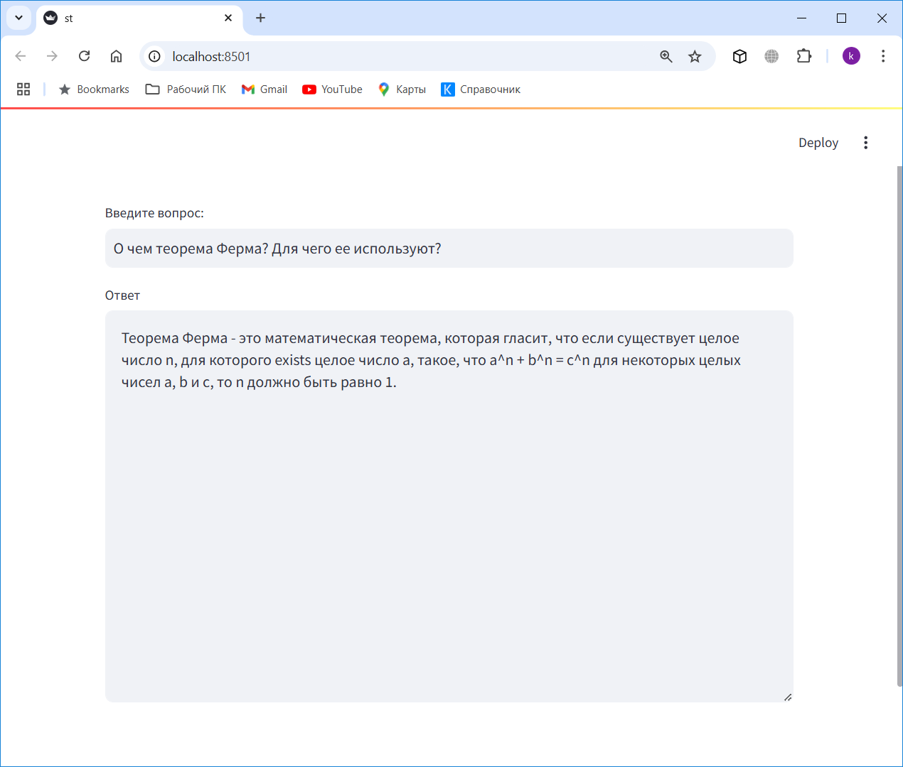

# Локальный RAG (Retrieval-Augmented Generation) и Агенты 
В этих примерах использованы:

* **Ollama**: Инструмент, который позволяет запускать большие языковые модели (LLM) с открытым исходным кодом локально.

* **llama3.2:3b-instruct-fp16**: Модель Llama 3.2, настроенная только на текст, оптимизированы для использования 
в многоязычных диалогах, включая задачи агенского поиска и обобщения.

* **LangChain**: Фреймворк, который предоставляет стандартный интерфейс для взаимодействия с LLM, источниками данных
и другими компонентами.

* **LangGraph**: Представляет собой фреймворк для оркестровки сложных агентных систем и является более 
низкоуровневым и управляемым, чем агенты LangChain.

* **Embeddings**: Использована модель `intfloat/multilingual-e5-large` с HuggingFace.

* **Tavily**: Поисковая систему для Web поиска, оптимизированная для LLM и RAG. 
Необходимо создать свой аккаунт на https://tavily.com/
Сформировать свое значение `TAVILY_API_KEY` и записать его в файл `.env`, см. пример в файле `env_example.txt`

---
## Источники:

* Статья "Local RAG agent with LLaMA3" https://langchain-ai.github.io/langgraph/tutorials/rag/langgraph_adaptive_rag_local/

* Видео (English 31 минута) Reliable, fully local RAG agents with LLaMA3.2-3b https://www.youtube.com/watch?v=bq1Plo2RhYI

---
## 1. Установить Ollama
https://ollama.com/download/windows

---

## 2. Установить модель Llama 3.2
Выполнить: `ollama pull llama3.2:3b-instruct-fp16`

Проверить наличие модели, выполнить: `ollama list`

---

## 3. Локальный LLM агент для генерации автотестов

Запускать модуль `Local_LLM_Agent.py`

Этот модуль предназначен для автоматической генерации JUnit тестов на основе описаний тест-кейсов. Основные возможности:
- Преобразование ручных тест-кейсов в автоматизированные тесты на Java
- Использование локальной LLM модели для генерации кода
- Сохранение сгенерированных тестов в отдельные файлы
- Подробное логирование процесса генерации

---

## 4. Локальный RAG агент

Запускать модуль `Local_RAG_Agent.py`


Этот модуль реализует продвинутый RAG с использованием агентного подхода:

* **Маршрутизация**: Адаптивный RAG. Направление вопросов к различным поисковым подходам
* **Возврат**: Корректирующий RAG. Возврат к веб-поиску, если документы не соответствуют запросу
* **Самокоррекция**: Самокоррекция RAG. Исправление ответов, содержащих галлюцинации или не отвечающих на вопрос


---

## 5. Как создать Базу Знаний без GPU
Используем GPU в colab-e, см. нотебук `db_tool_01.ipynb`: [](https://colab.research.google.com/github/kvoloshenko/Local_RAG_Agent_01/blob/main/Colab/db_tool_01.ipynb)

---

## 6. Пользовательский интерфейс на streamlit

Запускать:
1. Активировать venv, выполнить: `activate` 
2. Перейти в каталог Python: `cd ../../Python`
3. Выполнить: `streamlit run st.py`
4. Приложение открыть в Браузере: http://localhost:8501/



---

## Структура проекта

```
.
├── Colab/                  # Ноутбуки Google Colab
├── db/                     # Векторная база данных
├── log/                    # Логи работы приложения
├── pdf/                    # PDF файлы для обработки
├── responses/             # Сгенерированные ответы
├── test_cases/           # Тест-кейсы
├── Local_LLM_Agent.py    # Агент для генерации автотестов
├── Local_RAG_Agent.py    # RAG агент
└── st.py                 # Streamlit интерфейс
```


